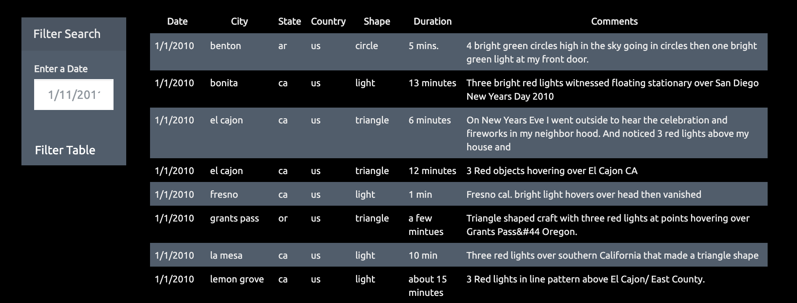
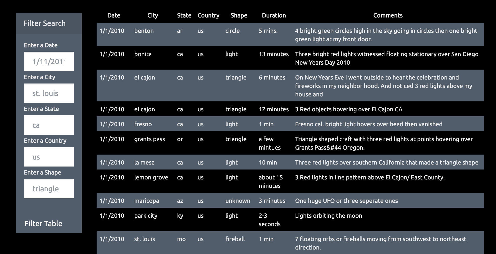

# UFO Sightings

## Project Overview

The goal of this project was to use JavaScript, HTML, CSS, and D3.js to create a table dynamically from the given [dataset of UFO sightings](UFO-level-1/static/js/data.js) and to allow users to be able to filter the table data for specific values. 

## Technologies Used

- JavaScript
- HTML
- CSS
- Bootstrap
- D3.js

## UFO-Level-1

For the first step of this project, an [HTML](UFO-level-1/index.html) webpage was created and D3.js was used to create a dynamic table, where each new row of the data was added to the table line by line. Rather than written into the HTML code itself, this code can be found in the [app.js](UFO-level-1/static/js/app.js) file under the [UFO-level-1](UFO-level-1/static/js) folder. The user can pull up the webpage and view the table, and then filter the data in the table based on date/time variable. 

## UFO-Level-2

The second portion of this project is almost exactly the same except the user can filter the data in the table based on multiple of the following variables:

- date/time
- city 
- state
- country
- shape

